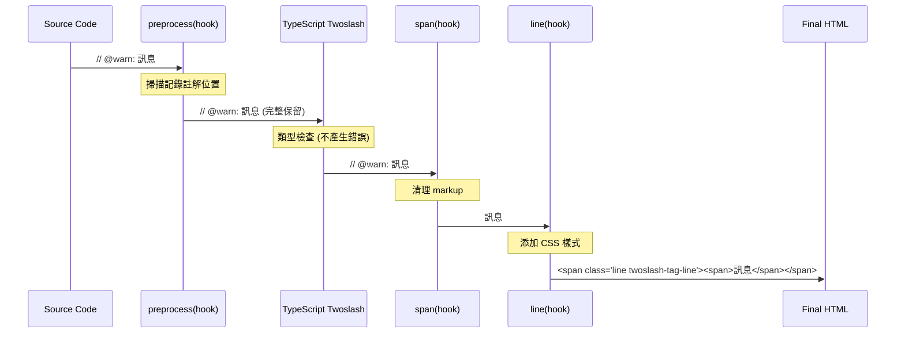

# Shiki Setup - Custom Annotation Transformer

## 概述

`createCustomAnnotationTransformer` 是一個基於 Shiki.js Transformer Hooks 的自定義註解轉換器，用於在 Slidev 代碼區塊中支援特殊的標記語法，並自動添加 Twoslash 風格的樣式。

## 功能特性

- 支援 `@warn`, `@error`, `@log`, `@annotate` 四種註解類型
- 自動清理 markup 語法，只保留純訊息內容
- 添加對應的 `.twoslash-tag-line` 到 `<pre>` 的 `<span>` 中
- 避免與 TypeScript Twoslash 類型檢查功能產生衝突

## 使用方式

在 Slidev 的代碼區塊中使用以下語法。
公式：`// @[type]: [message]`

```ts
function add(a: number, b: number) {
  return a + b
}

const result = add(5, 2)
// @warn: 這會顯示為黃色背景的警告訊息
const warningCase = add(5.5, 2.1)

// @error: 這會顯示為紅色背景的錯誤訊息
// @log: 這會顯示為藍色背景的日誌訊息
// @annotate: 這會顯示為灰色背景的註解訊息
```

## Transformer Hooks 選擇邏輯

### 三階段設計原理

基於 [Shiki.js Transformer Hooks](https://shiki.style/guide/transformers) 官方執行順序，我們選擇了以下三個階段：

#### 1. `preprocess` - 掃描記錄階段
- **目的**: 檢索 code block 中的註解，記錄註解位置和類型
- **重要**: 不修改原始代碼，保持完整的註解語法
- **原因**: 讓 TypeScript Twoslash 能看到完整的註解進行類型檢查，避免產生錯誤標記（如 `.twoslash-error`）

#### 2. `span` - 清理 markup 階段
- **目的**: 在類型檢查完成後，清理 `@type:` markup
- **操作**: 將 `// @warn: 訊息` 轉換為 `訊息`
- **時機**: 在 TypeScript Twoslash 執行後，避免產生錯誤標記

#### 3. `line` - 添加樣式階段
- **目的**: 為註解行添加 Twoslash CSS 樣式
- **樣式**: `twoslash-tag-line` + `twoslash-tag-{type}-line`
- **優勢**: 作用於每一行的 HAST 節點（`<span class="line">`），以結構化方式添加樣式，避免字串替換與位移問題。
  HAST 是一種 HTML 的抽象語法樹（HTML AST），Shiki 以它為中介處理結果並產生最終 HTML，於此階段操作可獲得最精準、最穩定的樣式控制。

### 為什麼不使用其他階段？

- **`tokens`**: 比 `span` 更複雜，需要處理 token 級別的偏移計算
- **`postprocess`**: 太晚執行，TypeScript Twoslash 已經將 `@type:` 標記為錯誤
- **`code`/`pre`/`root`**: 容器級別的操作，不適合處理行級註解

## 執行時序圖



## 技術細節

### 支援的註解類型
- `@warn`: 警告訊息 (黃色背景)
- `@error`: 錯誤訊息 (紅色背景)
- `@log`: 日誌訊息 (藍色背景)
- `@annotate`: 一般註解 (灰色背景)

### 正規表達式
```typescript
/^(\s*)\/\/\s*@(warn|error|log|annotate):(.*)$/
```
- 捕獲縮排、註解類型和訊息內容
- 支援任意縮排層級
- 自動 trim 訊息前後空白

### CSS class name rules
- 基礎 log 樣式: `twoslash-tag-line` (所有註解通用，也是 `@log` 的預設樣式)
- 其他 annotation 樣式: `twoslash-tag-${type}-line` (僅當 `type !== 'log'` 時添加)
- 參考: [style-rich.css](https://github.com/shikijs/shiki/blob/main/packages/twoslash/style-rich.css)（來源：`@shikijs/twoslash` 預設樣式）
- 範圍調整：為了同時支援 Slidev 的 Shiki 與 Twoslash 兩種渲染，本專案於 `src/styles/shiki.css` 中，將官方的選擇器 `.twoslash .twoslash-tag-line` 改為 `.shiki .twoslash-tag-line`。Twoslash 的 `<pre>` 也會帶有 `.shiki` 樣式，因此能同時覆蓋兩種模式。

**特殊說明**: 根據官方 Twoslash 樣式，`@log` 類型僅使用基礎樣式 `twoslash-tag-line`，不添加額外的 `twoslash-tag-log-line` 樣式。

## 相關檔案

- `shiki.ts`: 主要實現
- `../styles/shiki.css`: 相關 CSS 樣式（包含自 `style-rich.css` 擷取且調整過的樣式，以 `.shiki` 作為上層選擇器）
```css
/* rendererRich Custom Tags */
.shiki .twoslash-tag-line {
  margin-bottom: 0;
  margin-top: 0;
}
```

## 注意事項

1. 註解必須以 `//` 開頭
2. `@type:` 語法必須完整正確
3. 訊息內容會自動清理前後空白
4. 支援任意縮排層級
5. 與 TypeScript Twoslash 完全相容